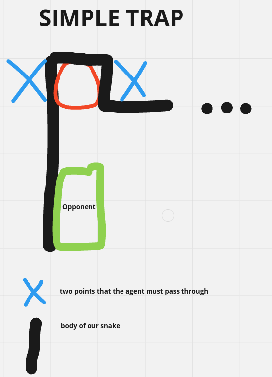
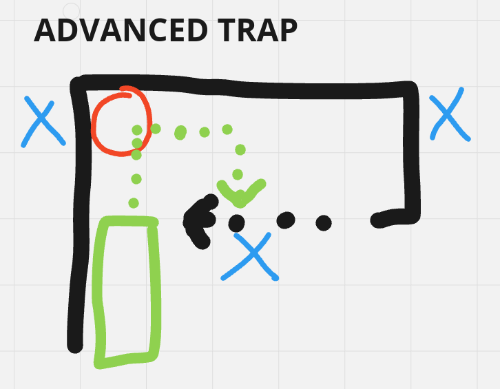

### Steps to Predict the Opponent's Next Move

#### 1. **Identify the Opponent's Head and Tail**

   - Use the **sight data** to locate the body of the opponent (`SNAKE = 4` in our sight).
   - **Determine the head**:
    - Part of the snake that moves into previously unoccupied spaces (PASSAGE = 0).

   - **Determine the tail (advanced)**:
    - Part of the snake that moves to the position previously occupied by the second-to-last part of the body.

#### 2. **Generate Possible Moves**

   - From the head's position, generate all valid moves:
     - Up, Down, Left, Right (considering the map boundaries and whether wrapping is possible).
   - Filter out moves that lead to **immediate collision**:
     - Collision with walls (`STONE = 1`).
     - Collision with its own body (`SNAKE = 4`).
   - There is already a function that does this. We can use it for the opponent snake.  

#### 3. **Evaluate the Best Move from the Possible Moves**
   Since we do not know the rules the opponent uses, consider these heuristics:
   - **Priority 1: Default behaviour**:
     - If no food is nearby, assume the opponent will move straight unless forced to turn.

   - **Priority 2 (advanced) : Move towards food (we should assume this is True by default)**:
     - If there is food (`FOOD` or `SUPER`) in the sight range, calculate the distance to each food and prioritise moves that minimise this distance.
 
#### 4. **Handling Wrapping (advanced)**
   - Note: In the beginning assume always `self.traverse=True` because this inference is complicated.
   
   - Opponent possible moves depends on (`self.traverse`):
     - **Traverse = True**: Include wraparound moves in possible directions.
     - **Traverse = False**: Exclude wraparound moves.
   - We can have 2 different approaches:
1. **Secure Approach (assume always `self.traverse=True`)**:
   - **Pros**: Simple and avoids misjudgments; ensures robust predictions.
   - **Cons**: Misses opportunities to exploit the opponent's inability to wrap. Exploiting `self.traverse=False` can yield high rewards (e.g., forcing opponents into traps or beating them to food). 

2. **Dynamic Adjustment Based on Observed Behaviour**:
   - **Worth It?**: Yes, if your strategy values exploiting weaknesses.
   - **Which indicators to look on?**: For instance, if the opponent does not have any food in his sight and is only doing exploration, if he avoid a internal wall this fact is a strong indicator of `self.traverse=False`. We should try to estimate his sight based on our sight and how close we are from the opponent.
   - Start with `self.traverse=True` by default because it's more secure.
   - If the opponent behaves as if `self.traverse=False` (e.g., avoids edges), assume `self.traverse=False` but revert to `self.traverse=True` if they suddenly wrap.
   - A **few steps (~5-10)** is reasonable to mantain the `self.traverse=False`, after that we should have a more secure approach and assume `self.traverse=True`. Food and poison effects can alter the opponent's traverse state.
   

#### 5. **Attack the Opponent (start by doing this)**
   - Create dead ends on fruits when you notice the opponent will try to eat some specific fruit. The majority of opponents won't have algorithms to deal with this. Notice that this only works when we are a extremely big (`lenght > NUMBER`). The goal would be to the other snake to touch in our body and die. To do this we can define two points that the agent must pass through. The food must be considered as a `ìgnored_goal` in this case, to be severe penalized. See the image below:

   

   - If the agent survive three times to this trap we conclude that he has algorithms to deal with this and we can try to do a more advanced trap. See the image below:

   

   Other option would be:
   If true, if we have a `lenght > NUMBER`, we could try to go on circles around the food. The goal would be the other snake to touch in our body and die. 
   If we do not have a `lenght > NUMBER`, I think it would be too risky to do this because we are missing out on foods while doing this and the opponent have a high probability to touch our head and we may die. Should be a balance between attack and defense.

#### 7. **Number of Players**

   - Should our strategy if instead of one opponent we have two opponents? 
      I think no because we would need to add a lot more logic. 

#### Conclusion and key ideas

- We should try to do first the `Class OpponentMapping` (see below) where we store all the data we know. 
Then we should start by evaluating the opponent next move. If our action, would make us die due to the opponent next move, that action should be huge penalized. 
Start by doing the **Attack the Opponent** section. After this think about the `advanced` sections.
---

### Class OpponentMapping

This class should have all the data that we know about the opponent and should be updated dinamically based on observed behaviour.

---

### **Data to Store in `Class OpponentMapping`**

#### **Immutable Data**

- **`name`**: The name of the opponent (unique identifier).

#### **Dynamic Data**

1. **Position Tracking**
   These values should be based on current observations in `sight` and inferred strategy.
   - **`direction`**: Corresponds to the previous_predicted_direction
   - **`head_position`**: Coordinates `(x, y)` of the opponent's head.
   - **`tail_position (advanced)`**: Coordinates `(x, y)` of the opponent's tail.
   - **`last_positions (advanced)`**: A list of the last 10 positions `(x, y)` the opponent's head occupied.

2. **Behavioural Analysis (advanced)**
   - **`moving_towards_food`**: Boolean value indicating whether the opponent is prioritising food based on its observed trajectory. By default should start = `True`
   - **`self_traverse`**: Opponent's wrapping ability (`True` or `False`), dynamically updated.

3. **Food Interaction**
   - **`target_food`**: Coordinates `(x, y)` of the food the opponent is likely targeting.

4. **Prediction**
   - **`predicted_direction`**: Estimated opponent direction. Can be inferred from the `head_position` and `predicted_head_position`.
   - **`predicted_head_position`**: The expected next position `(x, y)` of the opponent's head based on current observations and inferred strategy.

---
